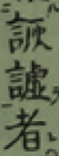
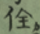
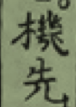
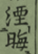

五山禪林之詩，固不易論也。蓋古昔文學盛於弘仁天曆，夷於延久寬治，泯沒於保元平治。於是世所謂五山禪林之文學代興。亦氣運盛衰之大限也。

24 讨论五山禅林的历史背景。包括镰仓幕府时期，大兴土木，僧侣的地位也非常高。玉牒之籍。但是江村北海的那个时代，有很多学者旧蔑视五山时期的汉诗。北海本人的评价是：

师承各异，题材亦歧。其诗今存者数百千首。夷考其中，不能不玉石相混也。若夫辞难意滞，涉议论杂，。与借诗以说禅演法者，皆余所不采者也。

——

对「我邦之诗」的强调

——

25:

曹学明诗选。载日本僧天祥诗十一首。诗五首。二僧被赏乎中土。而乎我邦。甚可叹惜。

——

孝谦帝为始。。。今无所考尔。