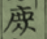
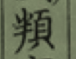
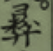

28 http://www.shuowen.org/
古曰：文学盛衰有关乎世道污隆信哉。征之我邦夫谁曰不然。
神武天皇东征，绥其士女帝功于是为盛然。时属草昧遐荒，犹阻王化。
应神天皇登极。而后三韩颡稽颡。虾夷献琛。巍巍桓桓，莫以尚焉。于是我邦始有六经云。
仁德天皇为皇子时，受经于百济博士。讲明唐虞之治。即位后，施为靡不由焉。是以海内乂安。众仰之。如日月戴之，如父母。仁慈恭俭之化入民心者。至深且固。历千百世无有。胡厥盛哉。自厥时后。列圣相承。文教日阐。余波及翰墨者，汪洋于弘仁天历间。可谓帝业与文学皆盛也。延久已降，朝纲解纽。文事日废。一坏于保元，再坏于承久。糜烂于元弘。建武之后，迄乎足利氏失其尘。邦国分裂，战争无已。生民涂炭，到此而极。艺苑事业，无复孑遗矣。既而天厌丧乱，织田氏丰臣氏迭兴中州，稍削平然，竞无学无术。马上得之，欲马上治之，是以天人不兴。或业坏乖成。或柞止一世。要之，拨乱反正。天必有待。而奎璧彂彩于久暗之后。固非偶然也。若夫神祖，圣文武。上翊戴帝室。下喣育德亿兆。干戈攘扰中。遄访耆老。以橐籥治道。广募遗书。以润色鸿业。又命惺窝先生，讲析经史之义。于是罗山先生，应聘东都。夫然后猛将勇士，稍知向学。而邦国宫寻兴。士业日广。至今百六十年。玉烛继光，金瓯无亏。风化之美，伦之正。亘古所无。而近时文华之茂，无让汉土。 

——

30

江村北海当时的儒学氛围：
然当时儒咏言，出于性理之绪余。乏温柔旨。

——

30 
明人避乱投化者。元赟外，有朱之瑜【朱舜水】。又有林荣，何倩，顾卿，僧独立辈。
31
省![][截屏2020-07-10下午83322]。

高季明，本姓大高坂氏。
【这个人受到林荣，何倩，顾卿的褒奖。但江村北海认为，其《芝山会稿》中的篇章，可采者没有几篇。他自己最欣赏高季明慷慨有气节，非常可惜他被那三人所误导。】

——

32
余少年时不解事意。轻其学术，。今而思之，殊为![][截屏2020-07-10下午84045]悔。其诗亦朴实。

与余先太父，同学相友善。余少年时，闻先考，数称其人。

——

33

说到北村可昌曾经受过天皇的一枚古砚。但他的儿子不肖，而且有残疾。他死后，不知道赐砚流落到哪里了。【传闻】

——

34

盖自惺窝先生讲学于京师，百有余年于兹其间，虽有以诗赋文章称者，风俗未漓，学必本经史，以翰墨为绪余。而云溪独以诗行。【对诗的体裁的认识】

34
下半页
当时学诗的风气

35
![][截屏2020-07-10下午85535]

说是在友人家的墙壁上偶然看到了一首好诗……

堀南湖。他的诗：
虽非大雅中正之音乎。天造奇逸，自有妙处。

![][截屏2020-07-10下午90005]

36
![][截屏2020-07-10下午90105]

![][截屏2020-07-10下午90234]
【评价观念，36】

37
关于森亿的轶事。

相翁曰：君实奇才，惜乎无寿。昌龄自是乐意游荡，操![][截屏2020-07-13上午93730]亦废，不数年，果死。

北海：余今录之，以戒少年才者云。

——

38
安田超。以诗挑诸文士，词锋颖甚。

—

僧惠实。号雪鼎。诗亦清雅，类其人云。

—

宇士新。
其诗纪律精详，一字不苟。遂能以此建旗鼓于一方，盖亦词坛雄。加之紧苦力学，志节凛凛，闻其风者，![][截屏2020-07-13上午94410]可小兴起。惜乎资性偏窄，规模甚隘。其诗亦得之苦思力索。是以规度合而变化不足，声调匀而神气离。

—

![][截屏2020-07-13上午94622]
有的人明明诗歌成就不高，但还是进入了诗史。

——

39
![][截屏2020-07-13上午94927]
余诵其诗若干首，颇有巧思，而世绝不知。由是思之，遗珠弃璧。

[截屏2020-07-10下午83322]: 截屏2020-07-10下午83322.png width=54px height=46px

[截屏2020-07-10下午84045]: 截屏2020-07-10下午84045.png width=67px height=60px

[截屏2020-07-10下午85535]: 截屏2020-07-10下午85535.png width=187px height=726px

[截屏2020-07-10下午90005]: 截屏2020-07-10下午90005.png width=55px height=374px

[截屏2020-07-10下午90105]: 截屏2020-07-10下午90105.png width=111px height=714px

[截屏2020-07-10下午90234]: 截屏2020-07-10下午90234.png width=193px height=705px

[截屏2020-07-13上午93730]: 截屏2020-07-13上午93730.png width=38px height=32px

[截屏2020-07-13上午94410]: 截屏2020-07-13上午94410.png width=51px height=44px

[截屏2020-07-13上午94622]: 截屏2020-07-13上午94622.png width=151px height=741px

[截屏2020-07-13上午94927]: 截屏2020-07-13上午94927.png width=44px height=166px