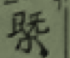

23。余考古籍，醫之以詩者絕無。以今思之，似不可解。【？？】如他邦。姑置之。今京城中業講說者，無慮數十人。執謁其門。靡匪醫家子弟除之，無複生徒。而醫生為學，亦唯不過習舉讀，學作詩，以潤飾自家術業。故雖間有才敏子弟，未至小成。既已鬢毳，其學蓋儒術。文藝不可立身糊口。而方技往往興家殖財也。是以近時為醫者，無不作詩。而善詩者，近罕矣。余謂古昔為醫，非如近時眾且濫也。宜其不見也。迄足利氏時，獨有阪士佛伊勢紀行詩云

——

